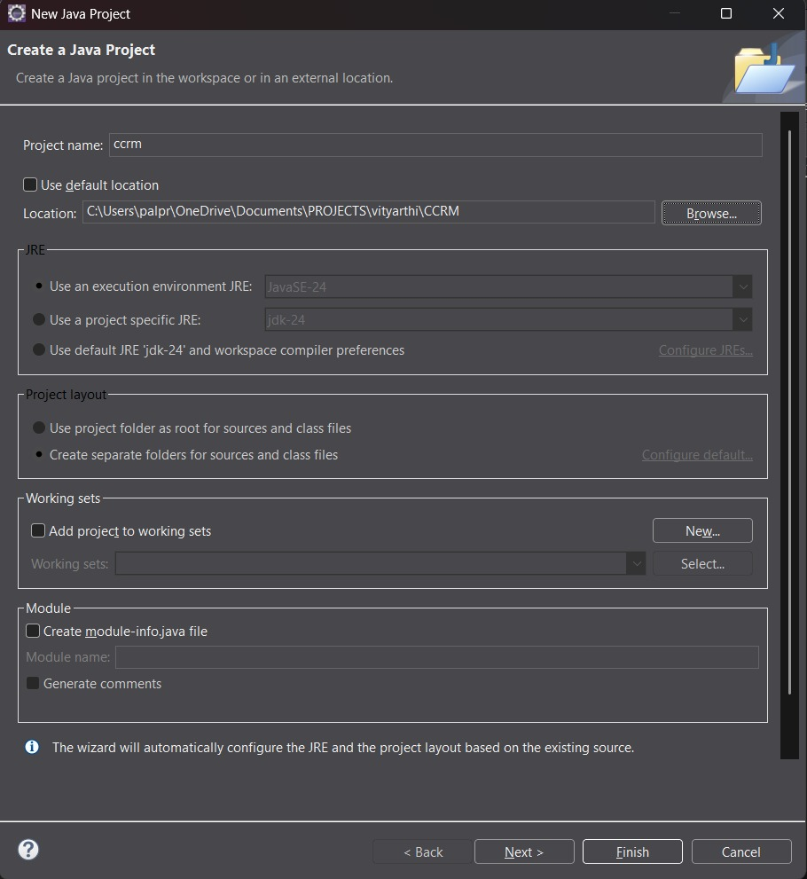

# Campus Course & Records Manager (CCRM)

The **Campus Course & Records Manager (CCRM)** is a comprehensive, console-based Java SE application that streamlines the management of students, courses, enrollments, grades, and academic records for educational institutes.

---

## Table of Contents

- [Features](#features)
- [Demo](#demo)
- [Getting Started](#getting-started)
  - [Prerequisites](#prerequisites)
  - [Installation](#installation)
  - [Run Instructions](#run-instructions)
- [Technical Highlights](#technical-highlights)
- [Sample Usage](#sample-usage)
- [Screenshots](#screenshots)
- [License](#license)
- [Author](#author)
- [Acknowledgments](#acknowledgments)

---

## Features

- **Student Management**: Create, update, and manage student profiles with enrollment tracking
- **Course Management**: Define, update, and assign instructors to courses
- **Enrollment System**: Robust enrollment rules and validations
- **Grading & Transcripts**: Grade recording, GPA calculation, transcript generation
- **File Operations**: Import/export CSV data with backup and archival
- **Report Generation**: Generate academic reports using modern Java Stream API

---

## Demo

_Run the CLI application with the following:_

# Campus Course & Records Manager (CCRM)

## Project Overview

The Campus Course & Records Manager (CCRM) is a comprehensive console-based Java SE application designed to help educational institutes manage their academic operations efficiently. This system provides complete functionality for managing students, courses, enrollments, grades, and academic records with robust file operations and data persistence capabilities.

### Key Features

- **Student Management**: Create, update, and manage student profiles and enrollment status
- **Course Management**: Handle course creation, updates, and instructor assignments
- **Enrollment System**: Manage student course enrollments with business rule validation
- **Grading & Transcripts**: Record grades, calculate GPA, and generate academic transcripts
- **File Operations**: Import/export data via CSV files with backup and archival capabilities
- **Reporting**: Generate various academic reports using modern Java Stream API

## How to Run

### Prerequisites

- **JDK Version**: Java 11 or higher
- **IDE**: Eclipse IDE for Java Developers (recommended)
- **Operating System**: Windows 10/11 (installation guide provided)

### Running the Application

1. Clone the repository:

   ```bash
   git clone [your-repository-url]
   cd CCRM
   ```

2. Compile the project:

   ```bash
   javac -d bin src/edu/ccrm/**/*.java
   ```

3. Run the application:

   ```bash
   java -cp bin edu.ccrm.cli.Main
   ```

4. **Enable Assertions** (recommended for testing):

   ```bash
   java -ea -cp bin edu.ccrm.cli.Main
   ```

## Evolution of Java

### Java Timeline - Key Milestones

- **1991**: Java project started at Sun Microsystems (originally named "Oak")
- **1995**: Java 1.0 released - "Write Once, Run Anywhere" philosophy
- **1997**: Java 1.1 - Inner classes, JavaBeans, JDBC introduced
- **1998**: Java 2 (J2SE 1.2) - Collections framework, Swing GUI toolkit
- **2000**: J2SE 1.3 - HotSpot JVM, Java Sound API
- **2002**: J2SE 1.4 - Regular expressions, NIO, XML processing
- **2004**: Java 5 (J2SE 1.5) - Generics, annotations, enums, enhanced for-loop
- **2006**: Java 6 (J2SE 6) - Performance improvements, scripting support
- **2011**: Java 7 - Diamond operator, try-with-resources, NIO.2
- **2014**: Java 8 - Lambda expressions, Stream API, functional interfaces
- **2017**: Java 9 - Module system, JShell, reactive streams
- **2018**: Java 10 - Local variable type inference (var keyword)
- **2018**: Java 11 - LTS release, HTTP client, string methods
- **2019**: Java 12-13 - Switch expressions, text blocks preview
- **2020**: Java 14-15 - Pattern matching, records preview
- **2021**: Java 16-17 - LTS release, sealed classes, pattern matching
- **2022-2024**: Java 18-21 - Virtual threads, pattern matching enhancements

## Java Editions Comparison

| Feature               | Java ME (Micro Edition)          | Java SE (Standard Edition)       | Java EE (Enterprise Edition)         |
| --------------------- | -------------------------------- | -------------------------------- | ------------------------------------ |
| **Target Platform**   | Mobile devices, embedded systems | Desktop applications, servers    | Enterprise web applications          |
| **Application Types** | Mobile apps, IoT devices         | Standalone applications, applets | Web services, enterprise apps        |
| **Core APIs**         | Limited subset of Java APIs      | Complete Java API set            | Java SE + additional enterprise APIs |
| **Memory Footprint**  | Minimal (KBs to few MBs)         | Moderate (10s to 100s of MBs)    | Large (100s of MBs to GBs)           |
| **Key Technologies**  | CLDC, MIDP, CDC                  | Swing, AWT, NIO, Collections     | Servlets, JSP, EJB, JPA, CDI         |
| **Examples**          | Feature phones, smart cards      | NetBeans, Eclipse, desktop tools | Banking systems, e-commerce          |
| **Current Status**    | Legacy (replaced by Android)     | Active development               | Transferred to Eclipse Foundation    |

## Java Architecture: JDK, JRE, JVM

### Java Virtual Machine (JVM)

The **JVM** is the runtime environment that executes Java bytecode. It provides:

- **Platform Independence**: Same bytecode runs on different operating systems
- **Memory Management**: Automatic garbage collection
- **Security**: Sandboxed execution environment
- **Performance**: Just-In-Time (JIT) compilation for optimization

### Java Runtime Environment (JRE)

The **JRE** contains everything needed to run Java applications:

- **JVM**: The core runtime engine
- **Core Libraries**: Essential Java APIs (java.lang, java.util, etc.)
- **Supporting Files**: Configuration files and resources
- **Note**: JRE = JVM + Core Libraries + Other Components

### Java Development Kit (JDK)

The **JDK** is the complete development environment:

- **JRE**: Everything needed to run Java applications
- **Development Tools**: Compiler (javac), debugger (jdb), documentation (javadoc)
- **Additional Utilities**: JAR tool, monitoring tools, profilers
- **Note**: JDK = JRE + Development Tools

### Interaction Flow

```
Source Code (.java) → [javac] → Bytecode (.class) → [JVM] → Native Machine Code → Execution
```

1. **Development**: Write Java source code using JDK tools
2. **Compilation**: javac compiler converts source to platform-neutral bytecode
3. **Execution**: JVM loads bytecode and converts to native machine code
4. **Runtime**: Application runs with JRE providing necessary libraries and services

## Java Installation on Windows

### Step-by-Step Installation Guide

#### Step 1: Download JDK

1. Visit [Oracle JDK Downloads](https://www.oracle.com/java/technologies/downloads/) or [OpenJDK](https://openjdk.org/)
2. Select **Windows x64 Installer** for your version (Java 11+ recommended)
3. Download the `.exe` file

#### Step 2: Install JDK

1. Run the downloaded installer as Administrator
2. Follow installation wizard (accept default paths)
3. Installation typically goes to `C:\Program Files\Java\jdk-[version]`

#### Step 3: Set Environment Variables

1. Open **System Properties** → **Advanced** → **Environment Variables**
2. Create **JAVA_HOME** variable:
   - Variable name: `JAVA_HOME`
   - Variable value: `C:\Program Files\Java\jdk-[version]`
3. Update **PATH** variable:
   - Add `%JAVA_HOME%\bin` to the PATH

#### Step 4: Verify Installation

Open Command Prompt and run:

```bash
java -version
javac -version
```

**Screenshot: Java Installation Verification**

_Figure 1: Verifying Java installation with version commands_

## Eclipse IDE Setup

### Installation Steps

1. Download **Eclipse IDE for Java Developers** from [eclipse.org](https://www.eclipse.org/downloads/)
2. Extract the downloaded archive to desired location
3. Launch Eclipse and select workspace location

### Creating New Java Project

1. **File** → **New** → **Java Project**
2. Project name: `CCRM`
3. Use default JRE (should match your installed JDK)
4. Create `src` folder structure with packages

**Screenshot: Eclipse Project Setup**

_Figure 2: Creating new Java project in Eclipse IDE_

### Run Configuration

1. Right-click on main class → **Run As** → **Java Application**
2. Configure run arguments if needed
3. Set up assertions: **Run Configurations** → **Arguments** → **VM arguments**: `-ea`

**Screenshot: Eclipse Run Config**

_Figure 3: Configuring run settings in Eclipse_

## Technical Implementation Mapping

| Syllabus Topic                  | Implementation Location                                                  | Description                                                                      |
| ------------------------------- | ------------------------------------------------------------------------ | -------------------------------------------------------------------------------- |
| **OOP - Encapsulation**         | `edu.ccrm.domain.*`                                                      | Private fields with getters/setters in Student, Course classes                   |
| **OOP - Inheritance**           | `edu.ccrm.domain.Person` → `Student`, `Instructor`                       | Abstract Person class extended by concrete classes                               |
| **OOP - Abstraction**           | `edu.ccrm.domain.Person`                                                 | Abstract class with abstract methods `getRole()`, `displayInfo()`                |
| **OOP - Polymorphism**          | `edu.ccrm.service.*` interfaces                                          | Persistable interface with multiple implementations                              |
| **Interfaces**                  | `edu.ccrm.service.Persistable`                                           | Generic interface with default methods                                           |
| **Enums**                       | `edu.ccrm.domain.Grade`, `Semester`                                      | Enums with constructors and fields                                               |
| **Exception Handling**          | `edu.ccrm.exception.*`                                                   | Custom exceptions: DuplicateEnrollmentException, MaxCreditLimitExceededException |
| **Collections Framework**       | `StudentService`, `CourseService`                                        | HashMap for storage, List for collections                                        |
| **Generics**                    | `Persistable<T>` interface                                               | Generic interface and method parameters                                          |
| **Lambda Expressions**          | `edu.ccrm.util.Comparators`                                              | Student sorting, course filtering predicates                                     |
| **Stream API**                  | `TranscriptService.generateReports()`                                    | GPA calculations, filtering, data aggregation                                    |
| **Date/Time API**               | `edu.ccrm.domain.Student`                                                | LocalDateTime for enrollment dates, timestamps                                   |
| **NIO.2**                       | `edu.ccrm.io.ImportExportService`                                        | Path, Files APIs for CSV operations                                              |
| **Recursion**                   | `edu.ccrm.util.RecursiveUtils`                                           | Directory size calculation, file tree traversal                                  |
| **Design Patterns - Singleton** | `edu.ccrm.config.AppConfig`                                              | Thread-safe singleton implementation                                             |
| **Design Patterns - Builder**   | `edu.ccrm.domain.Course.Builder`                                         | Builder pattern for Course construction                                          |
| **Nested Classes**              | `Course.Builder` (static), `TranscriptGenerator.ReportFormatter` (inner) | Static nested and inner class examples                                           |
| **Anonymous Classes**           | `MainMenu.createComparator()`                                            | Anonymous Comparator implementation                                              |
| **Assertions**                  | Throughout service classes                                               | Invariant checking with assert statements                                        |

## Package Structure and Architecture

The project's codebase is organized into several logical packages, each with a distinct responsibility. This modular design helps in maintaining a clean separation of concerns and improves overall code organization.

```
src/edu/ccrm/
├── cli/           # Command Line Interface components
│   └── CLIApplication.java  # Main application entry point and handles all user interactions and menu navigation.
├── config/        # Application Configuration
│   └── AppConfig.java       # Manages application-wide settings, such as data storage locations.
├── domain/        # Core Domain Models
│   ├── Course.java          # Represents a course offered.
│   ├── Grade.java           # Defines the grading scale.
│   ├── Instructor.java      # Represents an instructor (extends Person).
│   ├── Person.java          # Abstract base class for all individuals in the system.
│   ├── Semester.java        # Defines academic semesters.
│   ├── Student.java         # Represents a student (extends Person).
│   └── TranscriptEntry.java # Records a student's performance in a single course.
├── io/            # Input/Output Operations
│   └── ImportExportService.java # Handles reading from and writing to CSV files for data persistence.
├── service/       # Business Logic Layer
│   ├── CourseService.java   # Manages course-related operations.
│   ├── EnrollmentService.java # Handles student enrollment in courses.
│   ├── GradingService.java  # Manages grade assignment and GPA calculation.
│   └── StudentService.java  # Manages student-related operations.
└── util/          # Utility Classes
    └── BackupUtility.java   # Provides functionality for backing up application data.
```

## Enabling Assertions

Assertions are used throughout the application to verify invariants and preconditions. To enable assertions:

### Command Line

```bash
# Enable all assertions
java -ea edu.ccrm.cli.Main

# Enable for specific package
java -ea:edu.ccrm.domain... edu.ccrm.cli.Main

# Enable system assertions
java -esa edu.ccrm.cli.Main
```

### Eclipse IDE

1. **Run** → **Run Configurations**
2. Select your configuration → **Arguments** tab
3. In **VM arguments**, add: `-ea`

### Example Assertion Usage

```java
// In StudentService.java
public void enrollStudent(String studentId, String courseCode) {
    assert studentId != null && !studentId.trim().isEmpty() : "Student ID cannot be null or empty";
    assert courseCode != null && !courseCode.trim().isEmpty() : "Course code cannot be null or empty";

    Student student = findById(studentId);
    assert student != null : "Student must exist before enrollment";

    // Business logic continues...
}
```

## Sample Commands and Usage

### Basic Operations

```bash
# Start application
java -ea -cp bin edu.ccrm.cli.Main

# Menu navigation examples:
# 1. Manage Students
# 2. Manage Courses
# 3. Enrollment Operations
# 4. Grade Management
# 5. Reports and Transcripts
# 6. File Operations
# 7. Backup and Recovery
# 0. Exit
```

### File Operations Examples

The application supports importing/exporting data through CSV files:

**Sample Student CSV Format:**

```csv
personId,registrationNumber,fullName,email
```

**Sample Course CSV Format:**

```csv
courseCode,title,credits,instructorPersonId,semester,department
```

### Sample Data and Importing

Sample CSV files are provided in the `test-data/` directory to help you get started with testing the import functionality.

**Sample Data Location:**

- `test-data/students.csv`
- `test-data/courses.csv`

**To import sample data:**

1. Run the application.
2. From the main menu, select option `5. Import/Export Data`.
3. Choose to import students or courses.
4. When prompted for the file path, you can either:
   - Enter `y` to use the default path (e.g., `data/students.csv` or `data/courses.csv`).
   - Enter `n` and then provide the full path to the sample file, e.g., `/home/zeref/dev/code/java/projects/CCRM-project/test-data/students.csv`.

## Project Demonstration Flow

When you run the application, you'll experience:

1. **Initialization**: AppConfig singleton loads configuration settings
2. **Main Menu**: Console-based menu system with numbered options
3. **Student Operations**: Add/update/list students with validation
4. **Course Management**: Create courses using Builder pattern, search with Stream API
5. **Enrollment System**: Enroll students with business rule validation
6. **Grade Recording**: Record grades and calculate GPA automatically
7. **File Operations**: Import sample data, export current state
8. **Backup System**: Create timestamped backups with recursive directory operations
9. **Reports**: Generate academic reports using Stream operations
10. **Platform Info**: Display Java SE vs ME vs EE summary

## Screenshots

**Note**: As an AI, I cannot generate or display images directly. The original screenshots are not available.

## Technical Notes

### Java Platform Summary

This application demonstrates **Java SE (Standard Edition)** capabilities:

- **Java SE**: Provides core APIs for desktop applications, server-side development
- **Java ME**: Designed for resource-constrained devices (legacy)
- **Java EE**: Enterprise features for web applications and distributed systems

### Performance Considerations

- Uses HashMap for O(1) lookup performance in services
- Stream API for efficient data processing and filtering
- NIO.2 for improved file I/O performance
- Lazy initialization in Singleton pattern

### Future Enhancements

- Database persistence with JDBC
- GUI interface using JavaFX or Swing
- RESTful API endpoints for web integration
- Advanced reporting with data visualization

## Acknowledgments

This project was developed as part of Java Programming coursework, demonstrating comprehensive usage of Java SE features, OOP principles, and software engineering best practices. All code is original implementation following academic integrity guidelines.

### References

- **Official Java Documentation**:
  - [Oracle Java Documentation](https://docs.oracle.com/en/java/)
- **Books for Deeper Understanding**:
  - "Clean Code: A Handbook of Agile Software Craftsmanship" by Robert C. Martin
  - "Head First Java" by Kathy Sierra and Bert Bates
  - "Java Concurrency in Practice" by Brian Goetz
- **Online Learning Platforms/Communities**:
  - [Baeldung](https://www.baeldung.com/)
  - [Stack Overflow](https://stackoverflow.com/questions/tagged/java)

---

**Author**: Abhisek Das 
**Reg. No.**: 24BCE10147
**Course**: Programming in Java  
**Institution**: Vellore Institute of Technology, Bhopal  
**Date**: 15-09-2025  
**Version**: 1.0
# Campus Course & Records Manager (CCRM)

The **Campus Course & Records Manager (CCRM)** is a comprehensive, console-based Java SE application that streamlines the management of students, courses, enrollments, grades, and academic records for educational institutes.

---

## Table of Contents

- [Features](#features)
- [Demo](#demo)
- [Getting Started](#getting-started)
  - [Prerequisites](#prerequisites)
  - [Installation](#installation)
  - [Run Instructions](#run-instructions)
- [Technical Highlights](#technical-highlights)
- [Sample Usage](#sample-usage)
- [Screenshots](#screenshots)
- [License](#license)
- [Author](#author)
- [Acknowledgments](#acknowledgments)

---

## Features

- **Student Management**: Create, update, and manage student profiles with enrollment tracking
- **Course Management**: Define, update, and assign instructors to courses
- **Enrollment System**: Robust enrollment rules and validations
- **Grading & Transcripts**: Grade recording, GPA calculation, transcript generation
- **File Operations**: Import/export CSV data with backup and archival
- **Report Generation**: Generate academic reports using modern Java Stream API

---

## Demo

_Run the CLI application with the following:_

# Campus Course & Records Manager (CCRM)

## Project Overview

The Campus Course & Records Manager (CCRM) is a comprehensive console-based Java SE application designed to help educational institutes manage their academic operations efficiently. This system provides complete functionality for managing students, courses, enrollments, grades, and academic records with robust file operations and data persistence capabilities.

### Key Features

- **Student Management**: Create, update, and manage student profiles and enrollment status
- **Course Management**: Handle course creation, updates, and instructor assignments
- **Enrollment System**: Manage student course enrollments with business rule validation
- **Grading & Transcripts**: Record grades, calculate GPA, and generate academic transcripts
- **File Operations**: Import/export data via CSV files with backup and archival capabilities
- **Reporting**: Generate various academic reports using modern Java Stream API

## How to Run

### Prerequisites

- **JDK Version**: Java 11 or higher
- **IDE**: Eclipse IDE for Java Developers (recommended)
- **Operating System**: Windows 10/11 (installation guide provided)

### Running the Application

1. Clone the repository:

   ```bash
   git clone [your-repository-url]
   cd CCRM
   ```

2. Compile the project:

   ```bash
   javac -d bin src/edu/ccrm/**/*.java
   ```

3. Run the application:

   ```bash
   java -cp bin edu.ccrm.cli.Main
   ```

4. **Enable Assertions** (recommended for testing):

   ```bash
   java -ea -cp bin edu.ccrm.cli.Main
   ```

## Evolution of Java

### Java Timeline - Key Milestones

- **1991**: Java project started at Sun Microsystems (originally named "Oak")
- **1995**: Java 1.0 released - "Write Once, Run Anywhere" philosophy
- **1997**: Java 1.1 - Inner classes, JavaBeans, JDBC introduced
- **1998**: Java 2 (J2SE 1.2) - Collections framework, Swing GUI toolkit
- **2000**: J2SE 1.3 - HotSpot JVM, Java Sound API
- **2002**: J2SE 1.4 - Regular expressions, NIO, XML processing
- **2004**: Java 5 (J2SE 1.5) - Generics, annotations, enums, enhanced for-loop
- **2006**: Java 6 (J2SE 6) - Performance improvements, scripting support
- **2011**: Java 7 - Diamond operator, try-with-resources, NIO.2
- **2014**: Java 8 - Lambda expressions, Stream API, functional interfaces
- **2017**: Java 9 - Module system, JShell, reactive streams
- **2018**: Java 10 - Local variable type inference (var keyword)
- **2018**: Java 11 - LTS release, HTTP client, string methods
- **2019**: Java 12-13 - Switch expressions, text blocks preview
- **2020**: Java 14-15 - Pattern matching, records preview
- **2021**: Java 16-17 - LTS release, sealed classes, pattern matching
- **2022-2024**: Java 18-21 - Virtual threads, pattern matching enhancements

## Java Editions Comparison

| Feature               | Java ME (Micro Edition)          | Java SE (Standard Edition)       | Java EE (Enterprise Edition)         |
| --------------------- | -------------------------------- | -------------------------------- | ------------------------------------ |
| **Target Platform**   | Mobile devices, embedded systems | Desktop applications, servers    | Enterprise web applications          |
| **Application Types** | Mobile apps, IoT devices         | Standalone applications, applets | Web services, enterprise apps        |
| **Core APIs**         | Limited subset of Java APIs      | Complete Java API set            | Java SE + additional enterprise APIs |
| **Memory Footprint**  | Minimal (KBs to few MBs)         | Moderate (10s to 100s of MBs)    | Large (100s of MBs to GBs)           |
| **Key Technologies**  | CLDC, MIDP, CDC                  | Swing, AWT, NIO, Collections     | Servlets, JSP, EJB, JPA, CDI         |
| **Examples**          | Feature phones, smart cards      | NetBeans, Eclipse, desktop tools | Banking systems, e-commerce          |
| **Current Status**    | Legacy (replaced by Android)     | Active development               | Transferred to Eclipse Foundation    |

## Java Architecture: JDK, JRE, JVM

### Java Virtual Machine (JVM)

The **JVM** is the runtime environment that executes Java bytecode. It provides:

- **Platform Independence**: Same bytecode runs on different operating systems
- **Memory Management**: Automatic garbage collection
- **Security**: Sandboxed execution environment
- **Performance**: Just-In-Time (JIT) compilation for optimization

### Java Runtime Environment (JRE)

The **JRE** contains everything needed to run Java applications:

- **JVM**: The core runtime engine
- **Core Libraries**: Essential Java APIs (java.lang, java.util, etc.)
- **Supporting Files**: Configuration files and resources
- **Note**: JRE = JVM + Core Libraries + Other Components

### Java Development Kit (JDK)

The **JDK** is the complete development environment:

- **JRE**: Everything needed to run Java applications
- **Development Tools**: Compiler (javac), debugger (jdb), documentation (javadoc)
- **Additional Utilities**: JAR tool, monitoring tools, profilers
- **Note**: JDK = JRE + Development Tools

### Interaction Flow

```
Source Code (.java) → [javac] → Bytecode (.class) → [JVM] → Native Machine Code → Execution
```

1. **Development**: Write Java source code using JDK tools
2. **Compilation**: javac compiler converts source to platform-neutral bytecode
3. **Execution**: JVM loads bytecode and converts to native machine code
4. **Runtime**: Application runs with JRE providing necessary libraries and services

## Java Installation on Windows

### Step-by-Step Installation Guide

#### Step 1: Download JDK

1. Visit [Oracle JDK Downloads](https://www.oracle.com/java/technologies/downloads/) or [OpenJDK](https://openjdk.org/)
2. Select **Windows x64 Installer** for your version (Java 11+ recommended)
3. Download the `.exe` file

#### Step 2: Install JDK

1. Run the downloaded installer as Administrator
2. Follow installation wizard (accept default paths)
3. Installation typically goes to `C:\Program Files\Java\jdk-[version]`

#### Step 3: Set Environment Variables

1. Open **System Properties** → **Advanced** → **Environment Variables**
2. Create **JAVA_HOME** variable:
   - Variable name: `JAVA_HOME`
   - Variable value: `C:\Program Files\Java\jdk-[version]`
3. Update **PATH** variable:
   - Add `%JAVA_HOME%\bin` to the PATH

#### Step 4: Verify Installation

Open Command Prompt and run:

```bash
java -version
javac -version
```

**Screenshot: Java Installation Verification**

_Figure 1: Verifying Java installation with version commands_

## Eclipse IDE Setup

### Installation Steps

1. Download **Eclipse IDE for Java Developers** from [eclipse.org](https://www.eclipse.org/downloads/)
2. Extract the downloaded archive to desired location
3. Launch Eclipse and select workspace location

### Creating New Java Project

1. **File** → **New** → **Java Project**
2. Project name: `CCRM`
3. Use default JRE (should match your installed JDK)
4. Create `src` folder structure with packages

**Screenshot: Eclipse Project Setup**

_Figure 2: Creating new Java project in Eclipse IDE_

### Run Configuration

1. Right-click on main class → **Run As** → **Java Application**
2. Configure run arguments if needed
3. Set up assertions: **Run Configurations** → **Arguments** → **VM arguments**: `-ea`

**Screenshot: Eclipse Run Config**

_Figure 3: Configuring run settings in Eclipse_

## Technical Implementation Mapping

| Syllabus Topic                  | Implementation Location                                                  | Description                                                                      |
| ------------------------------- | ------------------------------------------------------------------------ | -------------------------------------------------------------------------------- |
| **OOP - Encapsulation**         | `edu.ccrm.domain.*`                                                      | Private fields with getters/setters in Student, Course classes                   |
| **OOP - Inheritance**           | `edu.ccrm.domain.Person` → `Student`, `Instructor`                       | Abstract Person class extended by concrete classes                               |
| **OOP - Abstraction**           | `edu.ccrm.domain.Person`                                                 | Abstract class with abstract methods `getRole()`, `displayInfo()`                |
| **OOP - Polymorphism**          | `edu.ccrm.service.*` interfaces                                          | Persistable interface with multiple implementations                              |
| **Interfaces**                  | `edu.ccrm.service.Persistable`                                           | Generic interface with default methods                                           |
| **Enums**                       | `edu.ccrm.domain.Grade`, `Semester`                                      | Enums with constructors and fields                                               |
| **Exception Handling**          | `edu.ccrm.exception.*`                                                   | Custom exceptions: DuplicateEnrollmentException, MaxCreditLimitExceededException |
| **Collections Framework**       | `StudentService`, `CourseService`                                        | HashMap for storage, List for collections                                        |
| **Generics**                    | `Persistable<T>` interface                                               | Generic interface and method parameters                                          |
| **Lambda Expressions**          | `edu.ccrm.util.Comparators`                                              | Student sorting, course filtering predicates                                     |
| **Stream API**                  | `TranscriptService.generateReports()`                                    | GPA calculations, filtering, data aggregation                                    |
| **Date/Time API**               | `edu.ccrm.domain.Student`                                                | LocalDateTime for enrollment dates, timestamps                                   |
| **NIO.2**                       | `edu.ccrm.io.ImportExportService`                                        | Path, Files APIs for CSV operations                                              |
| **Recursion**                   | `edu.ccrm.util.RecursiveUtils`                                           | Directory size calculation, file tree traversal                                  |
| **Design Patterns - Singleton** | `edu.ccrm.config.AppConfig`                                              | Thread-safe singleton implementation                                             |
| **Design Patterns - Builder**   | `edu.ccrm.domain.Course.Builder`                                         | Builder pattern for Course construction                                          |
| **Nested Classes**              | `Course.Builder` (static), `TranscriptGenerator.ReportFormatter` (inner) | Static nested and inner class examples                                           |
| **Anonymous Classes**           | `MainMenu.createComparator()`                                            | Anonymous Comparator implementation                                              |
| **Assertions**                  | Throughout service classes                                               | Invariant checking with assert statements                                        |

## Package Structure and Architecture

The project's codebase is organized into several logical packages, each with a distinct responsibility. This modular design helps in maintaining a clean separation of concerns and improves overall code organization.

```
src/edu/ccrm/
├── cli/           # Command Line Interface components
│   └── CLIApplication.java  # Main application entry point and handles all user interactions and menu navigation.
├── config/        # Application Configuration
│   └── AppConfig.java       # Manages application-wide settings, such as data storage locations.
├── domain/        # Core Domain Models
│   ├── Course.java          # Represents a course offered.
│   ├── Grade.java           # Defines the grading scale.
│   ├── Instructor.java      # Represents an instructor (extends Person).
│   ├── Person.java          # Abstract base class for all individuals in the system.
│   ├── Semester.java        # Defines academic semesters.
│   ├── Student.java         # Represents a student (extends Person).
│   └── TranscriptEntry.java # Records a student's performance in a single course.
├── io/            # Input/Output Operations
│   └── ImportExportService.java # Handles reading from and writing to CSV files for data persistence.
├── service/       # Business Logic Layer
│   ├── CourseService.java   # Manages course-related operations.
│   ├── EnrollmentService.java # Handles student enrollment in courses.
│   ├── GradingService.java  # Manages grade assignment and GPA calculation.
│   └── StudentService.java  # Manages student-related operations.
└── util/          # Utility Classes
    └── BackupUtility.java   # Provides functionality for backing up application data.
```

## Enabling Assertions

Assertions are used throughout the application to verify invariants and preconditions. To enable assertions:

### Command Line

```bash
# Enable all assertions
java -ea edu.ccrm.cli.Main

# Enable for specific package
java -ea:edu.ccrm.domain... edu.ccrm.cli.Main

# Enable system assertions
java -esa edu.ccrm.cli.Main
```

### Eclipse IDE

1. **Run** → **Run Configurations**
2. Select your configuration → **Arguments** tab
3. In **VM arguments**, add: `-ea`

### Example Assertion Usage

```java
// In StudentService.java
public void enrollStudent(String studentId, String courseCode) {
    assert studentId != null && !studentId.trim().isEmpty() : "Student ID cannot be null or empty";
    assert courseCode != null && !courseCode.trim().isEmpty() : "Course code cannot be null or empty";

    Student student = findById(studentId);
    assert student != null : "Student must exist before enrollment";

    // Business logic continues...
}
```

## Sample Commands and Usage

### Basic Operations

```bash
# Start application
java -ea -cp bin edu.ccrm.cli.Main

# Menu navigation examples:
# 1. Manage Students
# 2. Manage Courses
# 3. Enrollment Operations
# 4. Grade Management
# 5. Reports and Transcripts
# 6. File Operations
# 7. Backup and Recovery
# 0. Exit
```

### File Operations Examples

The application supports importing/exporting data through CSV files:

**Sample Student CSV Format:**

```csv
personId,registrationNumber,fullName,email
```

**Sample Course CSV Format:**

```csv
courseCode,title,credits,instructorPersonId,semester,department
```

### Sample Data and Importing

Sample CSV files are provided in the `test-data/` directory to help you get started with testing the import functionality.

**Sample Data Location:**

- `test-data/students.csv`
- `test-data/courses.csv`

**To import sample data:**

1. Run the application.
2. From the main menu, select option `5. Import/Export Data`.
3. Choose to import students or courses.
4. When prompted for the file path, you can either:
   - Enter `y` to use the default path (e.g., `data/students.csv` or `data/courses.csv`).
   - Enter `n` and then provide the full path to the sample file, e.g., `/home/zeref/dev/code/java/projects/CCRM-project/test-data/students.csv`.

## Project Demonstration Flow

When you run the application, you'll experience:

1. **Initialization**: AppConfig singleton loads configuration settings
2. **Main Menu**: Console-based menu system with numbered options
3. **Student Operations**: Add/update/list students with validation
4. **Course Management**: Create courses using Builder pattern, search with Stream API
5. **Enrollment System**: Enroll students with business rule validation
6. **Grade Recording**: Record grades and calculate GPA automatically
7. **File Operations**: Import sample data, export current state
8. **Backup System**: Create timestamped backups with recursive directory operations
9. **Reports**: Generate academic reports using Stream operations
10. **Platform Info**: Display Java SE vs ME vs EE summary

## Screenshots

**Note**: As an AI, I cannot generate or display images directly. The original screenshots are not available.

## Technical Notes

### Java Platform Summary

This application demonstrates **Java SE (Standard Edition)** capabilities:

- **Java SE**: Provides core APIs for desktop applications, server-side development
- **Java ME**: Designed for resource-constrained devices (legacy)
- **Java EE**: Enterprise features for web applications and distributed systems

### Performance Considerations

- Uses HashMap for O(1) lookup performance in services
- Stream API for efficient data processing and filtering
- NIO.2 for improved file I/O performance
- Lazy initialization in Singleton pattern

### Future Enhancements

- Database persistence with JDBC
- GUI interface using JavaFX or Swing
- RESTful API endpoints for web integration
- Advanced reporting with data visualization

## Acknowledgments

This project was developed as part of Java Programming coursework, demonstrating comprehensive usage of Java SE features, OOP principles, and software engineering best practices. All code is original implementation following academic integrity guidelines.

### References

- **Official Java Documentation**:
  - [Oracle Java Documentation](https://docs.oracle.com/en/java/)
- **Books for Deeper Understanding**:
  - "Clean Code: A Handbook of Agile Software Craftsmanship" by Robert C. Martin
  - "Head First Java" by Kathy Sierra and Bert Bates
  - "Java Concurrency in Practice" by Brian Goetz
- **Online Learning Platforms/Communities**:
  - [Baeldung](https://www.baeldung.com/)
  - [Stack Overflow](https://stackoverflow.com/questions/tagged/java)

---

**Author**: Abhisek Das<br>
**Reg. No.**: 24BCE10147<br>
**Course**: Programming in Java<br>
**Institution**: Vellore Institute of Technology, Bhopal<br>
**Date**: 23-09-2025<br>
**Version**: 1.0

